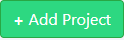
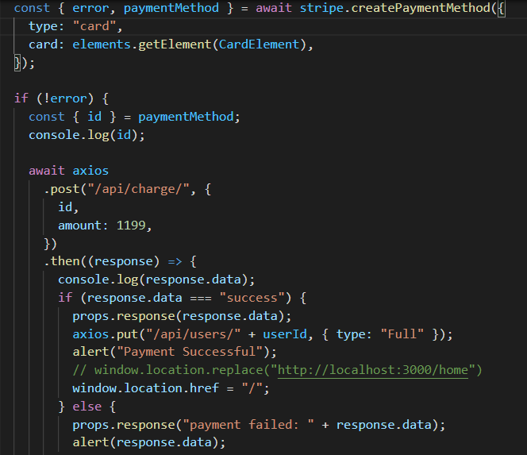

# Done.
**Creators**: `Hisham Saymeh, Dylan Ambrose, Sean Baklini, Barry Green`

**Created on**: `June 06 2020`

**Link to live app**: https://pm-hss.herokuapp.com/
- - -

## ABOUT THE APP
Done. is an all in one project management solution. Users can create accounts, add projects, add pertinent links, add project issues, add team members to projects, and message team members all from one convenient place.

### Creating an account
Users will need to create an account to access any of the features of Done. This can be done on the landing page.

A successfull sign up simultaneously creates a Firebase ID and adds the user to the database

### Creating projects
Users add new projects by clicking   and filling out the information on the popup modal.

A project card will the be populated on the home page

 #### Adding additional users to projects
 Team memembers can be added to the project by clicking the add user button and then selecting the user from the dropdown

The newly added user will receive and email invite

When the user clicks get started, they will be added to the project and will be able to access it from the home page

#### Adding issues

Once inside a project, users will have access to a responsive kanban board to add and manage issues.

### Free vs Full
A new user account will default to the free version. This allows them to create and manage up to 3 accounts. Free users will always have the option to upgrade to full. This will allow the user to have unlimited projects and grant them the ability to message team members.

### How to upgrade
Free account users can click  at anytime to upgrade their account. They will be routed to the payment screen to enter their payment information.

Stripe is used to process the payment. If the payment is successfull the user's account type is changed to full in the database

## Technologies Used
* React.js
* Stripe
* Nodemailer
* Firebase Authentication
* Javascript
* HTML
* Bootstrap
* Git
* GitHub
* Nodejs
* Node packages:
    * dotenv
    * express
    * if-env
    * mysql2 
    * nodemailer
    * sequelize
    * stripe
    * axios
    * bootstrap
    * firebase
    * react
    * react-bootstrap
    * react-dom
    * react-router-dom
    * react-scripts
